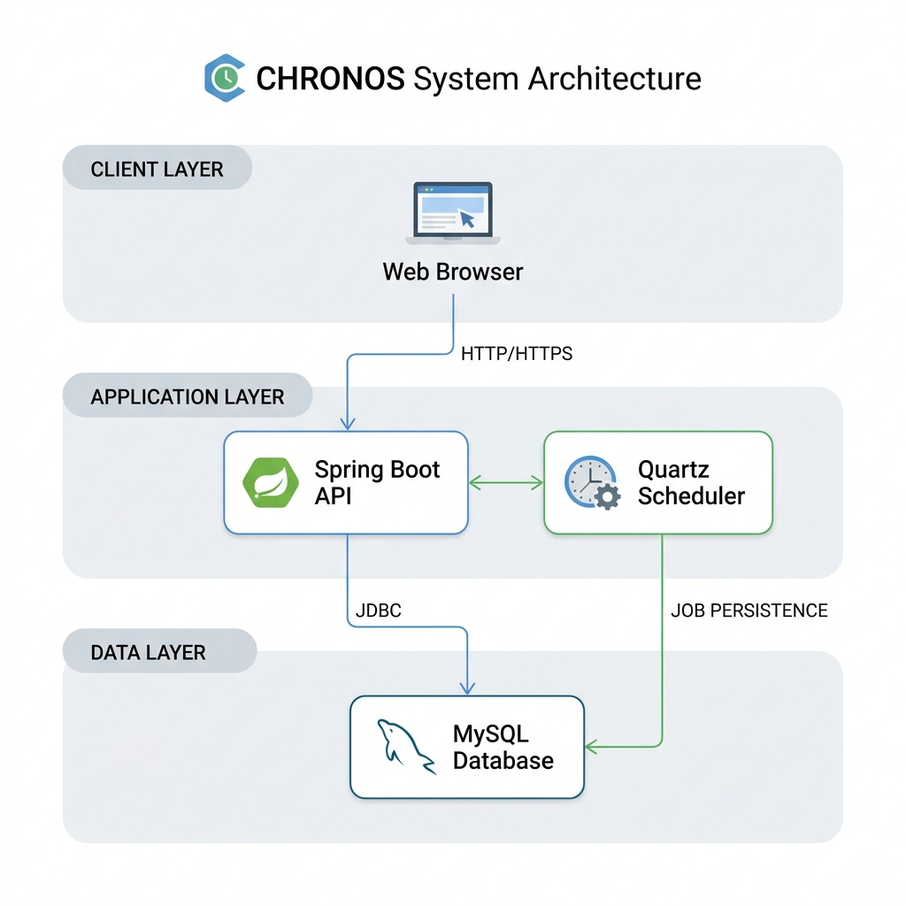

# Chronos: Enterprise-Grade Distributed Job Scheduler

**Chronos** is a high-performance, distributed-ready job scheduling system designed for reliability, transparency, and developer productivity. It combines a robust **Spring Boot** backend with a premium **React** interface, enabling real-time monitoring and management of complex background tasks.

---

## Live Demo

- **Frontend**: [https://akshayrocks09.github.io/chronos/](https://akshayrocks09.github.io/chronos/)
- **Backend API**: *[Coming Soon]*
- **API Documentation**: [Swagger UI (Local)](http://localhost:8080/swagger-ui/index.html)

---

## Table of Contents
- [Problem Statement](#problem-statement)
- [Key Features](#key-features)
- [Tech Stack](#tech-stack)
- [System Architecture](#system-architecture)
- [Project Structure](#project-structure)
- [Installation & Setup](#installation--setup)
- [Environment Variables](#environment-variables)
- [API Endpoints](#api-endpoints)
- [Database Schema](#database-schema)
- [Security](#security)
- [CI/CD](#cicd)
- [Optimizations](#optimizations)
- [Challenges Faced](#challenges-faced)
- [Future Scope](#future-scope)
- [License](#license)
- [Contact](#contact)

---

## Problem Statement

Traditional cron systems and simple task queues often fail to provide:
1. **Visibility**: No real-time dashboard to monitor job status or execution history.
2. **Reliability**: Lack of built-in retry mechanisms with exponential backoff.
3. **Persistence**: Jobs are often lost if the server restarts.
4. **Ease of Management**: Modifying or pausing jobs requires code changes or direct DB access.

**Chronos** solves these by providing a centralized, persistent, and highly observable scheduling engine.

---

## Key Features

- **Advanced Scheduling**: Support for one-time (timestamp-based) and recurring (Cron-based) jobs.
- **Fault Tolerance**: Automatic retries with **Exponential Backoff** (10s, 20s, 40s...).
- **Premium Dashboard**: Glassmorphic UI for real-time monitoring of job lifecycles.
- **Secure by Design**: JWT-based authentication and Role-Based Access Control (RBAC).
- **Execution Logs**: Detailed audit trails for every job execution, including failure stack traces.
- **Containerized**: Fully Dockerized for seamless deployment across environments.
- **Smart Resync**: Quartz-powered persistence ensures missed triggers are handled after downtime.

---

## Tech Stack

### Frontend
- **Framework**: React 18 (Vite)
- **Styling**: Tailwind CSS + Glassmorphism
- **Routing**: HashRouter (for GH Pages compatibility)
- **State Management**: React Context API
- **Icons**: Lucide React

### Backend
- **Framework**: Spring Boot 3.2.3
- **Language**: Java 21
- **Scheduler**: Quartz Scheduler (Clustered)
- **Security**: Spring Security + JWT
- **ORM**: Spring Data JPA

### Infrastructure & DevOps
- **Database**: MySQL 8.0
- **CI/CD**: GitHub Actions
- **Containerization**: Docker & Docker Compose
- **Hosting**: GitHub Pages (Frontend), Render (Recommended for Backend)

---

## System Architecture

<p align="center">
  
</p>

Chronos follows a classic **N-tier architecture**:
1. **Presentation Layer**: React-based SPA communicating via REST.
2. **Security Layer**: Stateless JWT filtering for all API requests.
3. **Service Layer**: Business logic for job management and validation.
4. **Scheduling Layer**: Quartz handles trigger management and thread pooling.
5. **Persistence Layer**: MySQL stores job definitions, logs, and user data.

---

## Project Structure

```bash
chronos/
├── chronos/                    # Backend Source
│   ├── src/
│   │   ├── main/java/com/chronos/
│   │   │   ├── config/         # App & Security Configurations
│   │   │   ├── controller/     # REST Endpoints
│   │   │   ├── dto/            # Data Transfer Objects
│   │   │   ├── entity/         # Database Models
│   │   │   ├── repository/     # Data Access Layer
│   │   │   ├── service/        # Business Logic
│   │   │   └── security/       # JWT & Auth Logic
│   │   └── resources/
│   │       ├── application.properties
│   │       └── db/changelog/   # Liquibase Migrations
│   └── pom.xml
├── chronos-ui/                 # Frontend Source
│   ├── src/
│   │   ├── api/                # Axios Client & Interceptors
│   │   ├── components/         # Reusable UI Components
│   │   ├── context/            # Auth & Global State
│   │   └── pages/              # View Components
│   ├── package.json
│   └── vite.config.js
├── .github/workflows/          # CI/CD Pipelines
├── assets/                     # Project Media
├── docker-compose.yml
└── README.md
```

---

## Installation & Setup

### Prerequisites
- **Java 21**
- **Node.js 18+**
- **Docker Desktop**

### 1. Clone the Repository
```bash
git clone https://github.com/akshayrocks09/chronos.git
cd chronos
```

### 2. Start the Database
```bash
docker-compose up -d
```

### 3. Setup Backend
```bash
cd chronos/chronos
# Build and run
mvn spring-boot:run
```

### 4. Setup Frontend
```bash
cd chronos/chronos/chronos-ui
npm install
npm run dev
```
Navigate to `http://localhost:5173`.

---

## Environment Variables

### Backend (.env)
```env
DB_URL=jdbc:mysql://localhost:3307/chronos_db
DB_USERNAME=root
DB_PASSWORD=root
JWT_SECRET=your_base64_encoded_secret_key_here
ADMIN_PASSWORD=your_secure_admin_password
```

### Frontend (.env)
```env
VITE_API_URL=http://localhost:8080/api
```

---

## Security

- **Stateless Authentication**: Uses JWT (JSON Web Tokens) for all secured routes.
- **Password Hashing**: BCrypt with a high cost factor.
- **RBAC**: Role-Based Access Control (ADMIN/USER) for job and log visibility.
- **Input Validation**: Strict DTO validation to prevent injection attacks.
- **Fail-Fast Policy**: System won't boot without a secure `JWT_SECRET` and `ADMIN_PASSWORD`.

---

## Optimizations

- **Quartz Clustering**: Prepared for horizontal scaling with database-backed job store.
- **Lazy Loading**: React components are lazy-loaded to minimize initial bundle size.
- **Transactional Consistency**: Complex transaction management ensuring logs are persisted even if jobs fail.
- **Interceptor Logic**: Centralized JWT management and error handling in Axios.

---

## Challenges Faced

1. **Transactional Integrity**: Ensuring that job execution logs were saved correctly even when the primary job transaction failed.
2. **Scheduling Sync**: Handling "Misfires" when the application is down and syncing Quartz triggers with the database state.
3. **Responsive UI**: Designing a glassmorphic dashboard that remains functional and beautiful across different screen sizes.

---

## Future Scope

- **Kubernetes Orchestration**: Auto-scaling worker nodes based on job queue depth.
- **Webhook Integration**: Triggering external services directly from the scheduler.
- **Email/Slack Alerts**: Real-time alerting for failed critical jobs.
- **AI Analytics**: Predictive scheduling based on job duration history.

---

## License

Distributed under the MIT License. See `LICENSE` for more information.

---

## Contact

**Akshay Thapa**  
- **LinkedIn**: [akshaythapa](https://www.linkedin.com/in/akshaythapa/)
- **Email**: [akshay1509thapa@gmail.com](mailto:akshay1509thapa@gmail.com)
